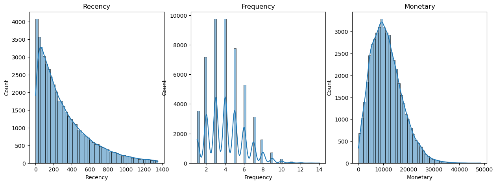
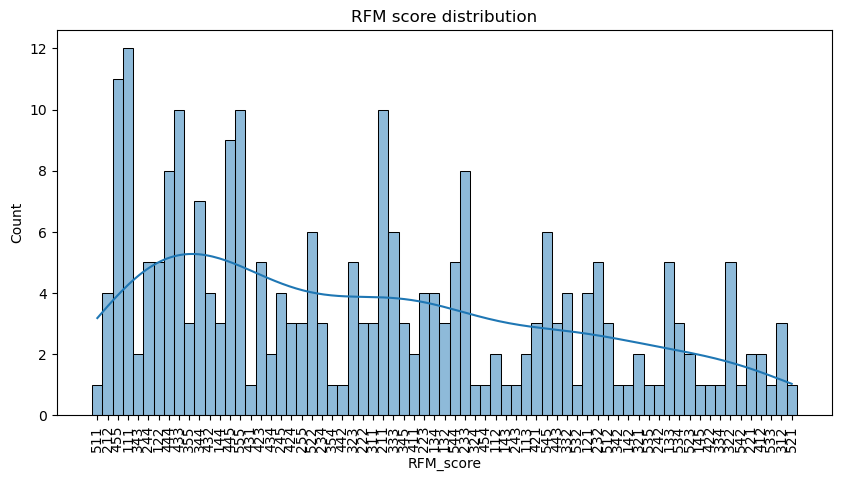
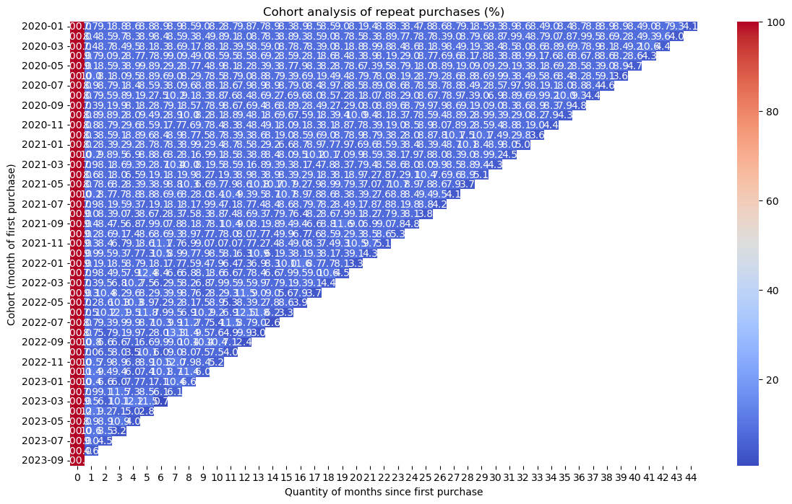
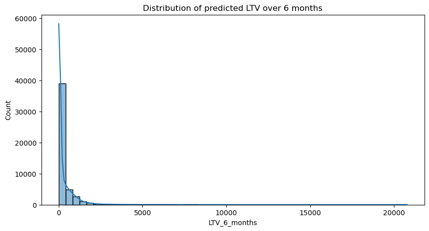
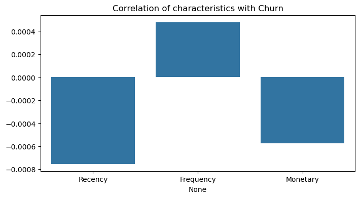
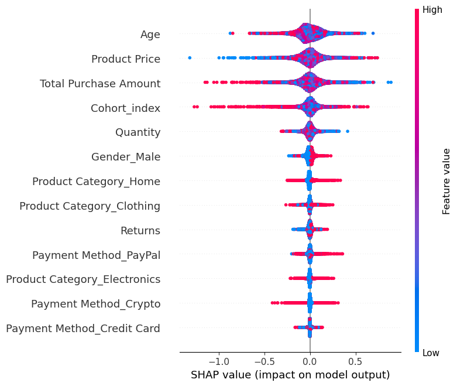

## 📈 Analysis-of-customer-behavior-and-forecasting-repeat-purchases-(LTV)

#### 🧾 Dataset used: "ecommerce_customer_data_custom_ratios" from Kaggle.

#### 📋 Objective
Understand which customers return and how to increase repeat purchases. It is necessary to calculate LTV (Lifetime Value) and segment customers by income level.

---

#### 🛠️ Tools & Technologies
- Python (Pandas, Numpy, Matplotlib, Seaborn)
- datetime, BetaGeoFitter, GammaGammaFitter, XGBClassifier, XGBoost, sklearn, shap
- Jupyter Notebook

---

#### 🔬 Key Findings
- RFM analysis revealed that 56.3% of customers are considered “loyal” and generate 64.9% of revenue.
  
| Customers by segment | Quantity |
| --- | --- |
| VIP | 13042 |
| Big Spenders | 1447 |
| Frequent | 3803 |
| At Risk | 11680 |
| Others | 15327 |
  
- Cohort analysis showed that retention declined after 1 month, by an average of 8% each month.
- The LTV forecast allows you to identify customers with high potential 30.5% of customers provide 2.4% of future revenue.
- Factors that greatly influence customer retention: Frequency, Age, Product Price, Total Purchase Amount, Cohort index.
- Xgboost model shows that with 80% probability the client will stay.

---

#### 💡 Recommendations
A. Increase retention:
- Set up email newsletter 7 days after first order.
- Offer new customers bundle offers or discounts on their second purchase.
- Launch personalized offers for "cold" clients (low recency).
- Resuscitation campaigns for old clients (R_Score <3, F_Score >1).
- Focus on retention in the first 30 days: promotions and bonuses for repeat purchases.

B. Working with segments:
- For VIP clients (R_Score >4, F_Score >4, M_Score >4) — exclusive offers and loyalty program.
- For clients with high Frequency but low Recency - return them with activity (discounts, bonuses).

C. Using LTV:
- Create personalized engagement scenarios for customers with high projected LTV.
- Integrate LTV into advertising (e.g. allow higher than average CPA for customers with LTV > $291).
- Assess the profitability of different acquisition channels taking into account the predicted LTV.

---

#### 📸 Visualizations

---

#### 👨💻 About Me
Hi, my name is Zhasulan Agybay and this is my third data analysis project. Check out my other projects on [GitHub](https://github.com/Zhasulan-Agybay).

---

#### ⚖️ License
This project is licensed under the MIT License. See the [LICENSE](./LICENSE) file for details.
